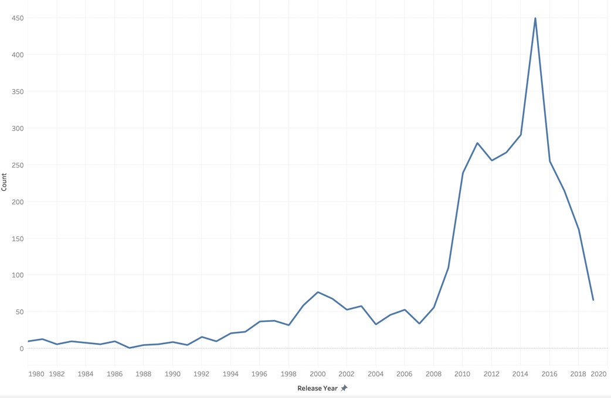
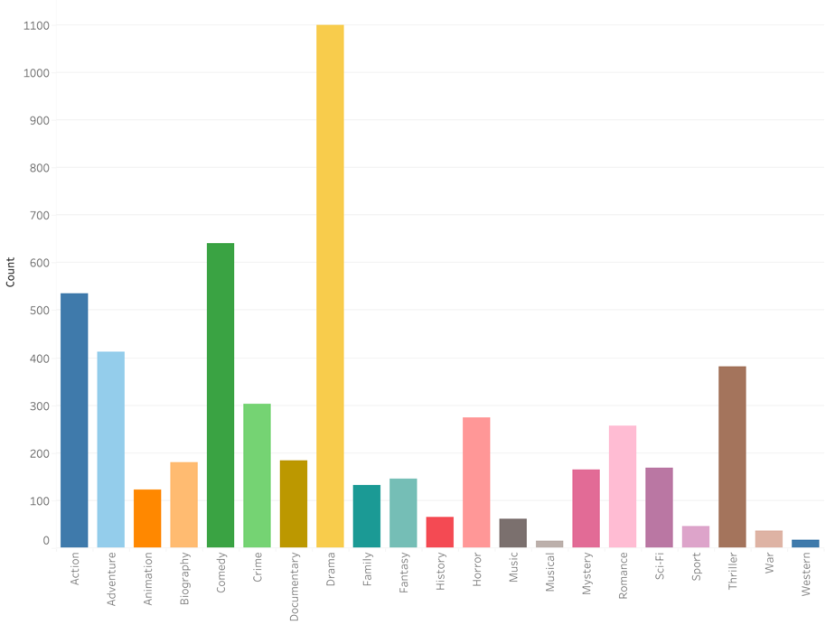
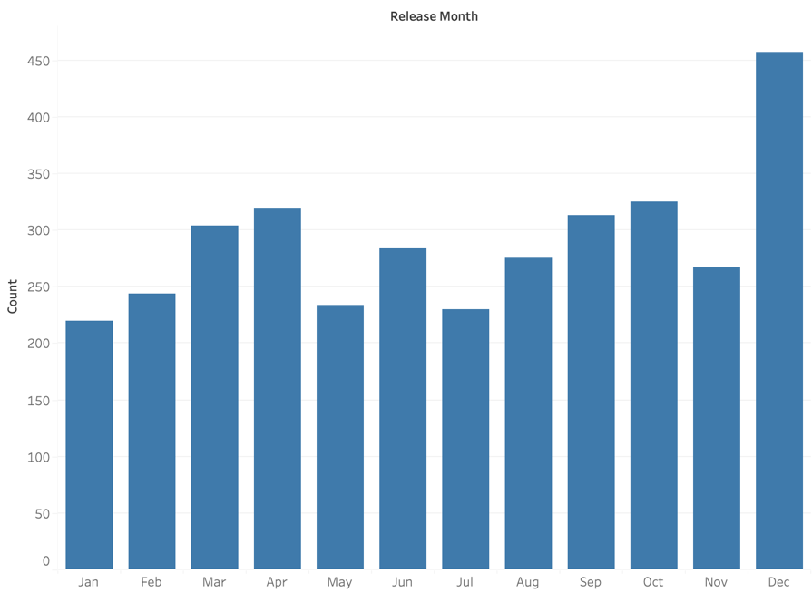
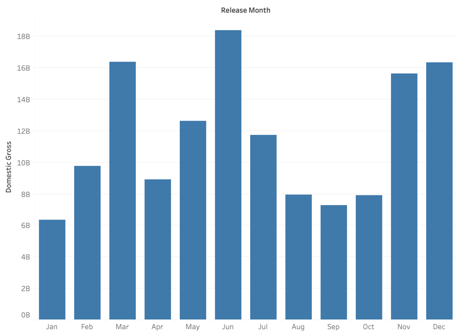
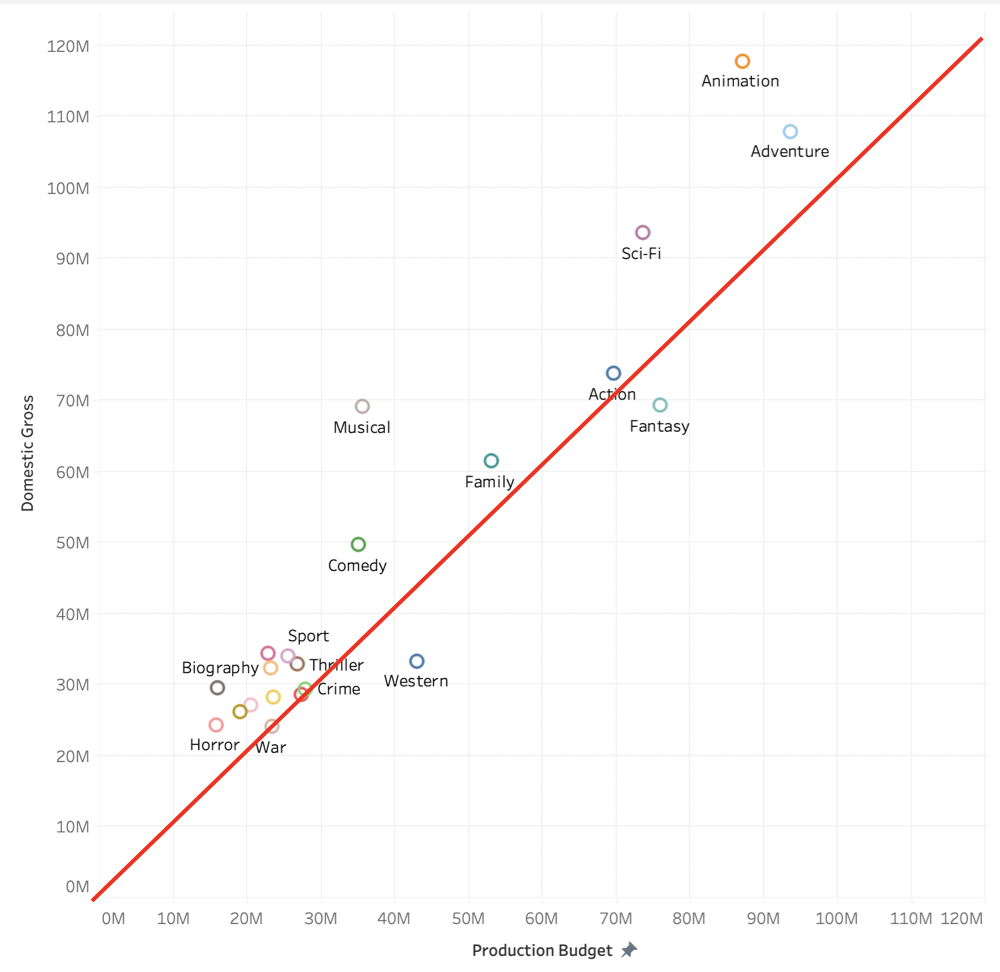
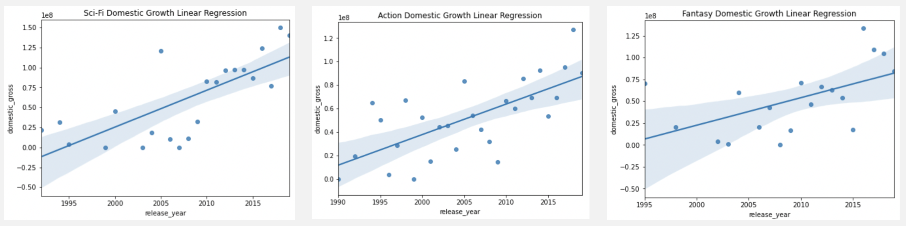
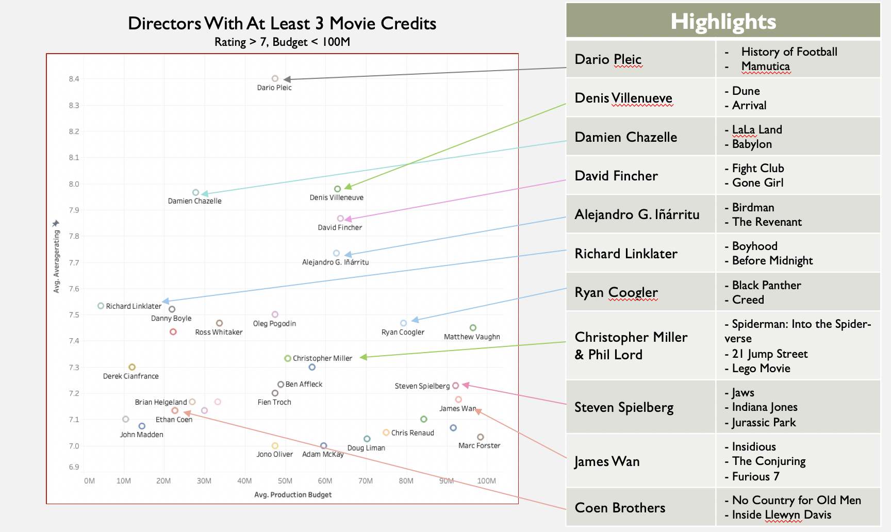
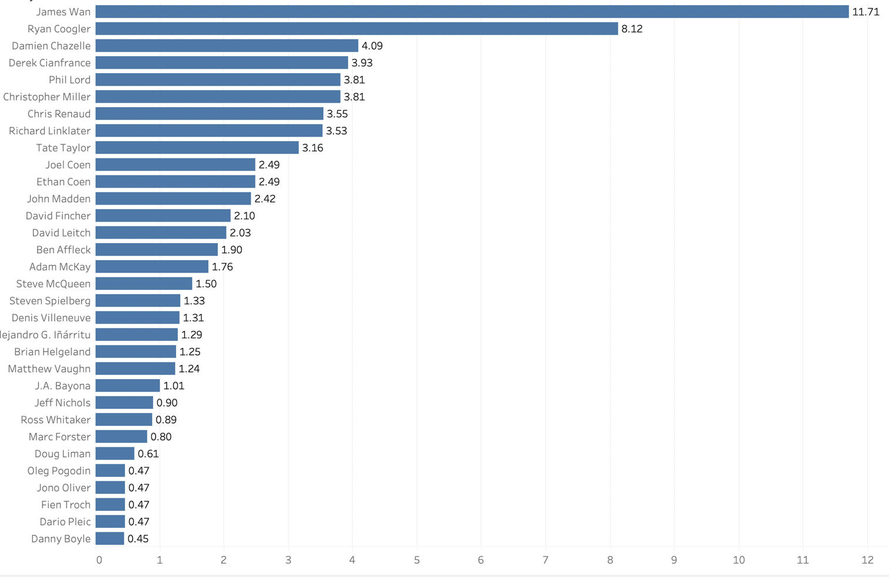

# Phase 2 Project
This is the repository that contains all files associated with the DS Flex Phase 2 Project.

## Project Overview

In this project, we used exploratory data analysis to investigate trends in film box office sales to genrate market entry insights for a company looking to enter the film industry.

### Business Problem

This company has decided to create a new movie studio, but they don’t know much about creating movies. Before investing in a large movie project, they need to know which types of movies are doing well, which directors perform well within a reasonable budget, and which time of year is best to release. The results of this project are summarized in a presentation suitable to be presented to a non-techinical audience and translated to make clear business recommendations.

### The Data

In the folder `zippedData` are movie datasets from:s

* [Box Office Mojo](https://www.boxofficemojo.com/)
* [IMDB](https://www.imdb.com/)
* [Rotten Tomatoes](https://www.rottentomatoes.com/)
* [TheMovieDB](https://www.themoviedb.org/)
* [The Numbers](https://www.the-numbers.com/)

Data from IMDB is located in a SQLite database.

The data sets used in the investigation were the IMDB SQL database, as well as the The Numbers data set. These data sets were combined to get box office and budget information for specific movies and genres, as well as box office and budget information for specific directors, as well as their ratings. 

Once combined, there were 2,253 entries in the combined movie information and budget data set, and 3,012 entires in the combined director information and budget data set. 

Figure 1: The number of movies relased per year in the combined movie information and budget data set, with the most ammount of data in years 2009-2016

Figure 2: The number of movies released per genre in the combined movie information and budget data set, with the most popular genres being drama, comedy, action, adventure, and thriller.  

### Analysis

The primary analysis work can be found in the jupityer notebook 'data_analysis.ipynb'

Data Cleaning: Movie Information
    - filtered out all movies made before 1980

Data Cleaning:Directors
    - filtered out all directors with less than three movies in the data set 
    - filtered out all directors with average budgets over $100M
    - filtered out all directors with average ratings below 7.0

Data Analysis: 

   - Determine which month is the best time to release a new movie
    
        
        Figure 3: Most popular month to release: December

        
        Figure 4: Highest grossing months: March, June, November, December

        
        Figure 5: Genres that produce ROI's greater than 1. 
            High Risk/High Reward: Animation, Sci-Fi
            Low Risk/Low Reward: Sport, Biography, Horror
            Middle Ground: Family, Aciton

        
        Figure 6: Genres increasing in popularity
            Sci-Fi and Action show the most likelyhood to increase in popularity

        - Which affordable, experienced directors have the highest ratings and ROI?

        
        Figure 7: Director Ratings vs their budget

        
        Figure 8: Director ROI. 
            Most Promissing: Damien Chazelle, Ryan Coogler, Christopher Miller & Phil Lord,  James Wan
    

### Recommendations

The analysis conlusions are outlined in a non-technical presentation found in this repository under 'Project2_presentation.pdf'

Best months to release: 
    - March 
    - June

Which genres are the best to start out in?
    - most potential: Sci-Fi, Action
    - safest: family, sport, horror

Which directors should we consider?
    - Damien Chazelle
    - Ryan Coogler
    - Christopher Miller & Phil Lord
    - James Wan

### Repository Structure
images Folder: images used in this ReadMe
data Folder: contains the  cleaned and combined data sets
pdfs Folder: contains the pdfs turned in as part of this project, including the presentation
zippedData: contains the original data sets
data_analysis.ipynb: the jupyter notebook containing the primary analyses
movie_data_erd.jpeg: image showing the structure of the IMDB SQL database

### Contact Information

Abigail Campbell
abbycampbell0@gmail.com